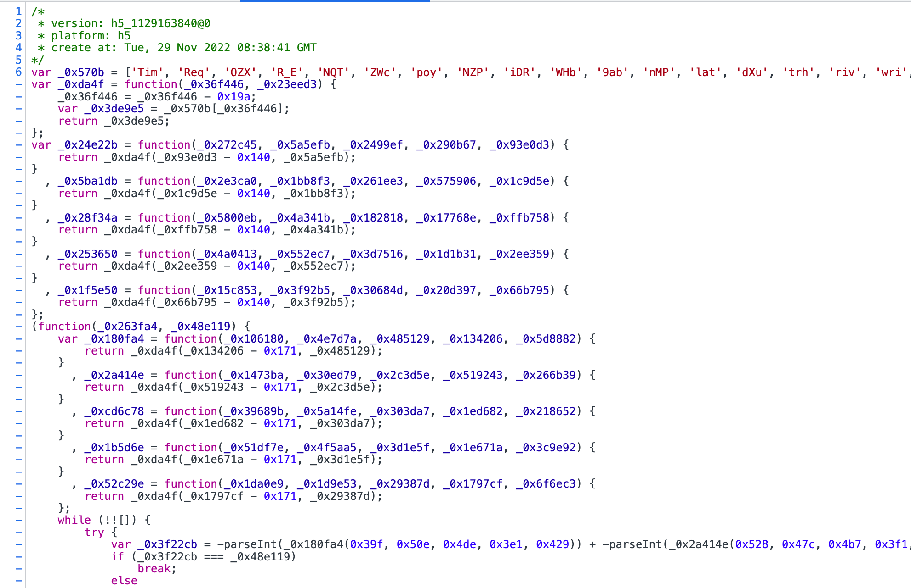
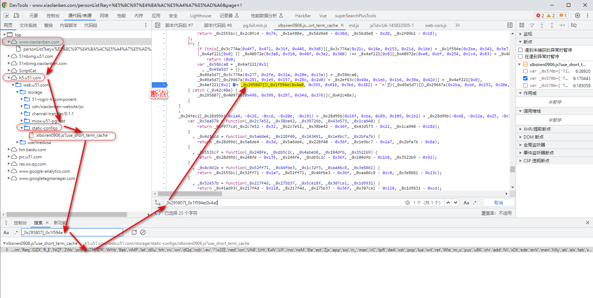
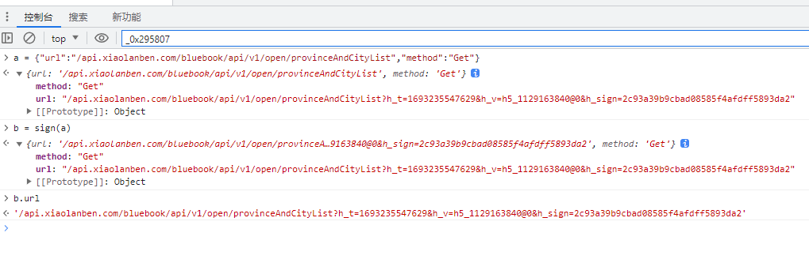
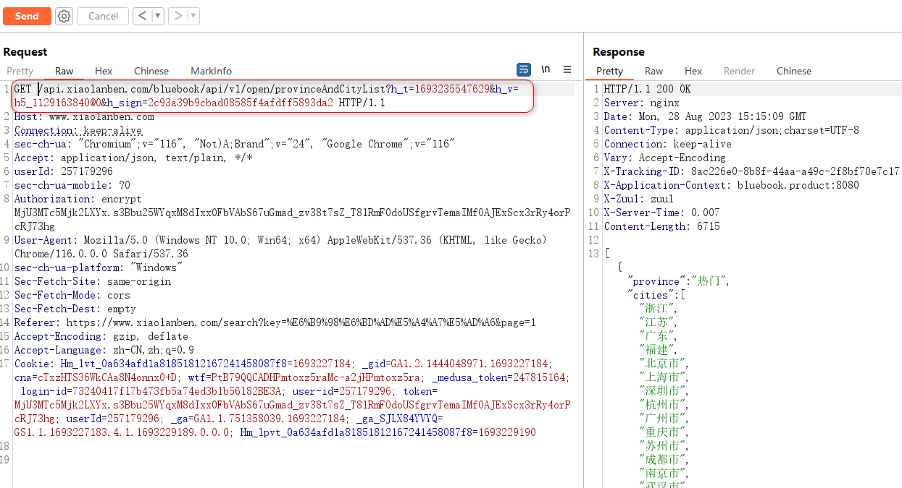
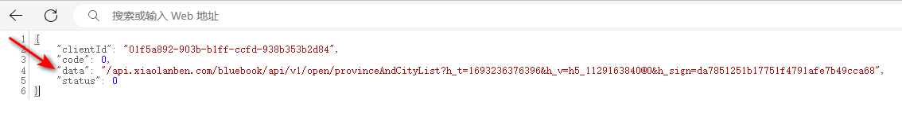

## 小蓝本 h_sign 远程获取 

  
** h_sign 的签名逻辑在这份代码里，整个js文件被obfuscator 混淆，不会配合AST反混淆，所以直接逆h_sign的算法更无从说起。 ** 
`https://h5.u51.com/web.u51.com/storage/static-configs/xlbsiren0906.js` 

 



### JSRPC 调用 h_sign 签名算法

全局搜索：`_0x295807[_0x1f594e`


断点位置：
```bash
_0x4af221[0x1] = _0x295807[_0x1f594e(0x4a0, 0x395, 0x418, 0x3b6, 0x282) + 'n'](_0x49a5d7)[_0x29667a(0x2ba, 0xb6, 0x152, 0x20e, 0x35c)];
```



调试代码，让流程走到这里，然后在控制台导出为全局函数：

```bash
windows.sign = _0x295807[_0x1f594e(0x4a0, 0x395, 0x418, 0x3b6, 0x282) + 'n'
```

这个导出的全局sign函数的参数是一个对象，例如：
```javascript
var a = {"url":"/api.xiaolanben.com/bluebook/api/v1/open/provinceAndCityList","method":"Get"}
```

测试一下：
```bash
b = sign(a)
b.url
```


得到签名：`/api.xiaolanben.com/bluebook/api/v1/open/provinceAndCityList?h_t=1693235547629&h_v=h5_1129163840@0&h_sign=2c93a39b9cbad08585f4afdff5893da2`

在burp中测试这个签名没有问题




### 搭建JSRPC


#### 在Linux或windows下建立`sekiro` 服务器

因为【小蓝本】是https站点，所以也必须给websocket配置好SSL证书，实现wss

自签名，配置好证书：


#### 在浏览器中添加脚本片段

```javascript
(function () {
    'use strict';
    function sek_start() {
        function guid() {
            function S4() {
                return (((1 + Math.random()) * 0x10000) | 0).toString(16).substring(1);
            }

            return (S4() + S4() + "-" + S4() + "-" + S4() + "-" + S4() + "-" + S4() + S4() + S4());
        }

     //创建webSocket 连接
        
        var client = new SekiroClientTest("wss://124.221.135.47/business-demo/register?group=xiaolanben&clientId=" + guid());
        //注册一个行动监听
        client.registerAction("sign", function (request, resolve, reject) {
            try {
                var method = request['method'];
                var url = atob(request['url']);
                console.log(url);
                var _signData = {
                 "url":url,
                  "method":method
                };
                var signData = window.sign(_signData).url;
                
                var result=JSON.stringify(signData)
                console.log(result)
                resolve(result)
            } catch (e) {
                reject("error: " + e);
            }
        });
        
    }

    console.log("超时连接")
    setTimeout(sek_start, 2000)


//==============================================================================================================================================//
// 连接配置函数, 不许修改
    function SekiroClientTest(e) {
        if (this.wsURL = e, this.handlers = {}, this.socket = {}, !e) throw new Error("wsURL can not be empty!!");
        this.webSocketFactory = this.resolveWebSocketFactory(), this.connect()
    }

    SekiroClientTest.prototype.resolveWebSocketFactory = function () {
        if ("object" == typeof window) {
            var e = window.WebSocket ? window.WebSocket : window.MozWebSocket;
            return function (o) {
                function t(o) {
                    this.mSocket = new e(o)
                }

                return t.prototype.close = function () {
                    this.mSocket.close()
                }, t.prototype.onmessage = function (e) {
                    this.mSocket.onmessage = e
                }, t.prototype.onopen = function (e) {
                    this.mSocket.onopen = e
                }, t.prototype.onclose = function (e) {
                    this.mSocket.onclose = e
                }, t.prototype.send = function (e) {
                    this.mSocket.send(e)
                }, new t(o)
            }
        }
        if ("object" == typeof weex) try {
            console.log("test webSocket for weex");
            var o = weex.requireModule("webSocket");
            return console.log("find webSocket for weex:" + o), function (e) {
                try {
                    o.close()
                } catch (e) {
                }
                return o.WebSocket(e, ""), o
            }
        } catch (e) {
            console.log(e)
        }
        if ("object" == typeof WebSocket) return function (o) {
            return new e(o)
        };
        throw new Error("the js environment do not support websocket")
    }, SekiroClientTest.prototype.connect = function () {
        console.log("sekiro: begin of connect to wsURL: " + this.wsURL);
        var e = this;
        try {
            this.socket = this.webSocketFactory(this.wsURL)
        } catch (o) {
            return console.log("sekiro: create connection failed,reconnect after 2s:" + o), void setTimeout(function () {
                e.connect()
            }, 2e3)
        }
        this.socket.onmessage(function (o) {
            e.handleSekiroRequest(o.data)
        }), this.socket.onopen(function (e) {
            console.log("sekiro: open a sekiro client connection")
        }), this.socket.onclose(function (o) {
            console.log("sekiro: disconnected ,reconnection after 2s"), setTimeout(function () {
                e.connect()
            }, 2e3)
        })
    }, SekiroClientTest.prototype.handleSekiroRequest = function (e) {
        console.log("receive sekiro request: " + e);
        var o = JSON.parse(e), t = o.__sekiro_seq__;
        if (o.action) {
            var n = o.action;
            if (this.handlers[n]) {
                var s = this.handlers[n], i = this;
                try {
                    s(o, function (e) {
                        try {
                            i.sendSuccess(t, e)
                        } catch (e) {
                            i.sendFailed(t, "e:" + e)
                        }
                    }, function (e) {
                        i.sendFailed(t, e)
                    })
                } catch (e) {
                    console.log("error: " + e), i.sendFailed(t, ":" + e)
                }
            } else this.sendFailed(t, "no action handler: " + n + " defined")
        } else this.sendFailed(t, "need request param {action}")
    }, SekiroClientTest.prototype.sendSuccess = function (e, o) {
        var t;
        if ("string" == typeof o) try {
            t = JSON.parse(o)
        } catch (e) {
            (t = {}).data = o
        } else "object" == typeof o ? t = o : (t = {}).data = o;
        (Array.isArray(t) || "string" == typeof t) && (t = {
            data: t,
            code: 0
        }), t.code ? t.code = 0 : (t.status, t.status = 0), t.__sekiro_seq__ = e;
        var n = JSON.stringify(t);
        console.log("response :" + n), this.socket.send(n)
    }, SekiroClientTest.prototype.sendFailed = function (e, o) {
        "string" != typeof o && (o = JSON.stringify(o));
        var t = {};
        t.message = o, t.status = -1, t.__sekiro_seq__ = e;
        var n = JSON.stringify(t);
        console.log("sekiro: response :" + n), this.socket.send(n)
    }, SekiroClientTest.prototype.registerAction = function (e, o) {
        if ("string" != typeof e) throw new Error("an action must be string");
        if ("function" != typeof o) throw new Error("a handler must be function");
        return console.log("sekiro: register action: " + e), this.handlers[e] = o, this
    };
})();


```


在python中调用这个RPC服务：

```url
https://$ip/business-demo/invoke?group=xiaolanben&action=sign&url=/api.xiaolanben.com/bluebook/api/v1/open/provinceAndCityList&pageId=1&pageSize=14&method=Get
```


